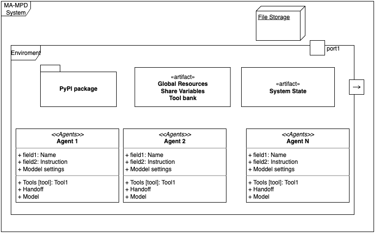
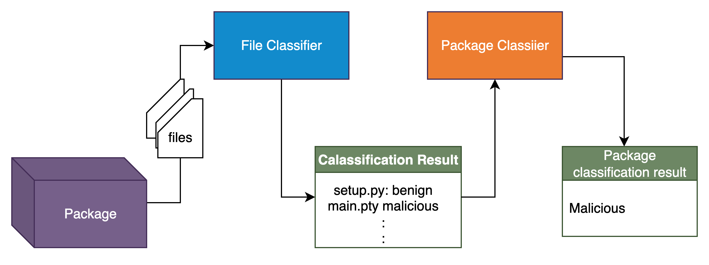

# MA-MPD: Multi-Agent Malicious Package Detection

An AI-powered system for detecting and classifying potentially malicious Python packages using multi-agent architecture powered by LangChain and large language models.

## 🎯 Overview

MA-MPD (Multi-Agent Python Package Detection) is an intelligent security tool that analyzes Python packages to identify potentially malicious code. The system employs a multi-agent architecture where specialized AI agents work together to extract metadata, analyze code patterns, and classify packages as benign or malicious.

**⚠️ Disclaimer**: This tool provides automated security analysis but should not be the sole method for determining package safety. Always exercise caution and verify package safety.

### Key Features

- 🤖 **Multi-Agent Architecture**: Specialized agents for package extraction, metadata analysis, and classification
- 📦 **Multiple Input Methods**: Upload files (.py, .zip, .tar.gz) or analyze packages directly from PyPI
- 🔍 **Deep Code Analysis**: Examines package structure, dependencies, and code patterns
- 🎨 **User-Friendly UI**: Streamlit-based web interface for easy interaction
- 🚀 **REST API**: FastAPI backend for programmatic access
- 🐳 **Docker Support**: Containerized deployment for easy setup and scalability
- 🔄 **Model Flexibility**: Support for multiple AI models (GPT-4, GPT-4o-mini, Gemini 2.0)

## 📋 Table of Contents

- [Architecture](#architecture)
- [Prerequisites](#prerequisites)
- [Installation](#installation)
- [Configuration](#configuration)
- [Usage](#usage)
  - [Using the Web Interface](#using-the-web-interface)
  - [Using the API](#using-the-api)
  - [Docker Deployment](#docker-deployment)
- [API Documentation](#api-documentation)
- [Project Structure](#project-structure)
- [Development](#development)
- [Contributing](#contributing)
- [License](#license)

## 🏗️ Architecture



The system uses a hierarchical multi-agent architecture:




### Agent Roles

1. **Root Agent (Supervisor)**: Orchestrates the analysis workflow, manages package extraction, and coordinates between specialized agents
2. **Metadata Agent**: Extracts package metadata including author information, dependencies, version, and description
3. **Classification Agent**: Analyzes code patterns, suspicious behaviors, and makes the final malicious/benign determination

## 🔧 Prerequisites

- **Python**: 3.11 or higher
- **Docker** (optional): 20.10+ with Docker Compose 2.0+
- **API Keys**: OpenAI API key or compatible AI model provider

## 📦 Installation


1. **Clone the repository:**
   ```bash
   git clone https://github.com/Motunrayo244/Multi-agent-Malicious-Package-Detector-MA-MPD-.git
   cd MA-MPD
   ```

### Local Installation

Step 1: Create a virtual environment. Install uv, follow the instructions in the [UV Installation Guide](https://docs.astral.sh/uv/getting-started/installation/). 
Step 2: Install dependencies
```bash
uv sync
```
Step 3: Creat a .env file and configure the required environment variables. see `env.sample` for more information.
Step 4: Modify the `config.ini` file to configure the AI model and other settings. 
set the `MASMPD_BASE_MODEL` to the name of the model you want to use. Ensure you have the necessary API key for the model provider and set it in the `.env` file.
Step 5: Run the API server
```bash
uvicorn api.classify:app --reload --host 0.0.0.0 --port 8000
```
Step 6: Run the Streamlit UI
```bash
streamlit run streamlit/check_malicious_package.py
```

### Docker Installation

Step 1. **Create your `.env` file:**
   ```bash
   cp env.sample .env
   # Edit .env and add your API key
   ```

Step 2. **Build and start services:**
   ```bash
   docker-compose up --build
   ```

Step 3. **Access the applications:**
   - API Documentation: http://localhost:8000/docs
   - Streamlit UI: http://localhost:8501


## ⚙️ Configuration

### Environment Variables

Create a `.env` file in the project root with the following variables:

```bash
# Required: AI Model Configuration
MODEL_API_KEY=your_api_key_here

# Optional: To log model conversations to LangSmith Tracing 
LANGCHAIN_API_KEY=your_langchain_key_here
LANGCHAIN_TRACING_V2=false
LANGCHAIN_PROJECT=ma-mpd
```

## 🚀 Usage

### Using the Web Interface


1. **Access the UI:** Open your browser to `http://localhost:8501` after running the Docker setup or the local setup.

4. **Analyze a package:**
   - Either:
     - Enter a PyPI package name and version, OR
     - Upload a package file (.py, .zip, .tar.gz)
   - Click "Check Package"
   - View the classification results with justification and suspicious files

### Using the API

**Analyze a PyPI package:**
```bash
curl -X POST "http://localhost:8000/classify" \
  -F "package_name=requests" \
  -F "version=2.28.0"
```

**Analyze an uploaded file:**
```bash
curl -X POST "http://localhost:8000/classify" \
  -F "upload_file=@/path/to/package.tar.gz"
```

**Response format:**
```json
{
  "package_name": "requests",
  "package_metadata": {
    "package_version": "2.28.0",
    "author_name": "Kenneth Reitz",
    "author_email": "me@kennethreitz.org",
    "package_homepage": "https://requests.readthedocs.io",
    "package_description": "Python HTTP for Humans.",
    "num_of_files": 45,
    "num_of_python_files": 32,
    "available_python_files": ["requests/api.py", "requests/sessions.py", ...]
  },
  "classification": "benign",
  "justification": "The package appears to be legitimate with standard HTTP functionality...",
  "suspicious_files": []
}
```


## 📚 API Documentation

Once the API server is running, visit `http://localhost:8000/docs` for interactive Swagger documentation.

### Endpoints

#### `POST /classify`

Classify a Python package as malicious or benign.

**Parameters:**
- `upload_file` (file, optional): Package file to analyze (.py, .zip, .tar.gz)
- `package_name` (string, optional): PyPI package name
- `version` (string, optional): Package version (latest if not specified)

**Note:** Must provide either `upload_file` OR `package_name`.

**Returns:**
- Package metadata
- Classification (benign/malicious)
- Justification
- List of suspicious files (if any)

## 📁 Project Structure

```
MA-MPD/
├── api/                      # FastAPI application
│   └── classify.py          # Main API endpoint
├── src/
│   ├── mampd_agents/        # Multi-agent system
│   │   ├── RootAgent.py     # Supervisor agent
│   │   ├── MetaDataAgent.py # Metadata extraction
│   │   ├── ClassificationAgent.py
│   │   ├── mampd_agent_interface.py
│   │   └── configure_mampd_agents.py
│   ├── scripts/             # Utility scripts
│   │   ├── classify_package.py
│   │   └── setup_logging.py
│   └── utilities/           # Helper modules
│       ├── extract_package.py
│       ├── model.py         # Model configuration
│       ├── package_state.py # State management
│       ├── prompts.py       # Agent prompts
│       ├── schemas.py       # Data schemas
│       └── tools.py         # Agent tools
├── streamlit/               # Streamlit web UI
│   └── check_malicious_package.py
├── logs/                    # Application logs
├── config.ini              # Model configuration
├── docker-compose.yml      # Docker orchestration
├── Dockerfile              # API container
├── Dockerfile.streamlit    # UI container
├── pyproject.toml          # Project dependencies
└── README.md              # This file
```


## 🤝 Contributing

Contributions are welcome! Please follow these steps:

1. Fork the repository
2. Create a feature branch (`git checkout -b feature/amazing-feature`)
3. Commit your changes (`git commit -m 'Add amazing feature'`)
4. Push to the branch (`git push origin feature/amazing-feature`)
5. Open a Pull Request

## 📄 License

This project is licensed under the terms specified in the [LICENSE](LICENSE) file.


## 📞 Support

For questions, issues, or feature requests, please open an issue on the GitHub repository.

## 🙏 Acknowledgments

- Built with [litellm](https://www.litellm.ai/) and [OpenAI Agents](https://github.com/openai/agents)
- UI powered by [Streamlit](https://streamlit.io/)
- API framework: [FastAPI](https://fastapi.tiangolo.com/)

